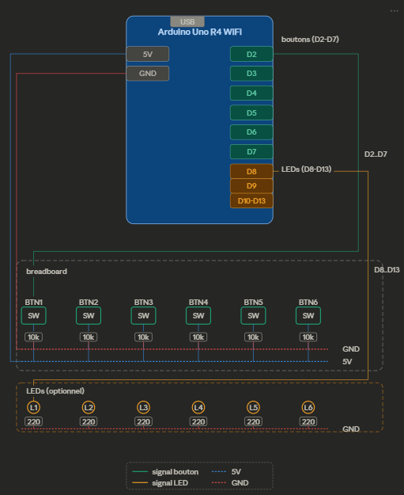
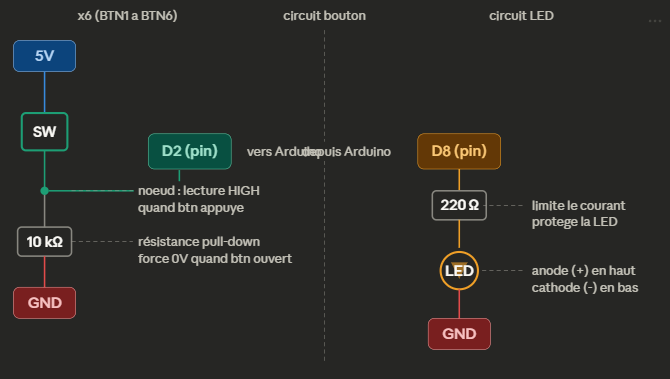

# 🎛️ StreamDeck DIY — Arduino Uno R4 WiFi

Un stream deck physique fait maison avec un Arduino Uno R4 WiFi et des boutons poussoirs, piloté par une application Windows légère et configurable.

---

## 📦 Utilisation rapide

**Tu veux juste utiliser l'application ?**

1. Télécharge `StreamDeck.exe` depuis le dossier `dist/`
2. Branche ton Arduino Uno R4 WiFi en USB
3. Lance `StreamDeck.exe` — c'est tout !

Aucune installation de Python ou de dépendances n'est nécessaire. L'exécutable embarque tout ce qu'il faut.

> La configuration est sauvegardée automatiquement dans `%APPDATA%\StreamDeck\config.json`

---

## 🔧 Matériel nécessaire

| Composant | Quantité | Prix indicatif |
|---|---|---|
| Arduino Uno R4 WiFi | 1 | ~25€ |
| Boutons poussoirs tactiles | 6 | ~2€ |
| Résistances 10kΩ (pull-down) | 6 | ~0.50€ |
| LEDs (optionnel, feedback visuel) | 6 | ~1€ |
| Résistances 220Ω (pour LEDs) | 6 | ~0.50€ |
| Breadboard + câbles Dupont | — | ~5€ |

**Total : ~35€**

---

## 🔌 Schéma de câblage

## 🔌 Schéma de câblage

### Vue d'ensemble



### Détail — un bouton + une LED



Le bouton est câblé en **pull-down** : la résistance 10kΩ entre le pin et le GND force la lecture à 0V quand le bouton est ouvert. Quand on appuie, le pin passe à 5V (HIGH) et l'Arduino détecte l'appui.

La résistance 220Ω en série avec la LED limite le courant pour ne pas griller ni la LED ni le pin Arduino.

| Composant | Connexion |
|---|---|
| Bouton pin 1 | 5V |
| Bouton pin 2 | Pin digital D2..D7 + résistance 10kΩ vers GND |
| LED anode (+) | Pin digital D8..D13 via résistance 220Ω |
| LED cathode (-) | GND |


```
Arduino Pin 2 ──────────┬──── Bouton ──── 5V
                         │
                        10kΩ
                         │
                        GND
```

Les 6 boutons utilisent les pins **2, 3, 4, 5, 6, 7**.  
Les 6 LEDs (optionnelles) utilisent les pins **8, 9, 10, 11, 12, 13**.

---

## 📋 Flasher l'Arduino

1. Ouvre l'IDE Arduino
2. Charge le fichier `deck.ino/deck.ino.ino`
3. Sélectionne la carte : `Arduino Uno R4 WiFi`
4. Téléverse le code

L'Arduino envoie `BTN:1` à `BTN:6` sur le port série quand un bouton est pressé.

---

## 🖥️ L'application

### Fonctionnalités

- **Grille de 6 boutons** configurables individuellement
- **Capture de raccourci** en un clic — appuie sur la combinaison de touches, elle est détectée automatiquement
- **Profils contextuels** — les boutons changent automatiquement selon l'application active (Discord, OBS, etc.)
- **Boutons globaux** — certains boutons restent actifs quel que soit le profil (ex: capture d'écran)
- **Changement de profil** — un bouton peut activer un profil manuellement
- **Détection automatique** du port COM Arduino
- **Config persistante** dans `%APPDATA%\StreamDeck\`

### Interface

| Zone | Description |
|---|---|
| Barre du haut | Statut de connexion Arduino + profil actif |
| Sélecteur de profil | Choisir quel profil configurer |
| Grille | Les 6 boutons avec leur label et raccourci |
| Panneau d'édition | Configurer le bouton sélectionné |
| ⚙️ Paramètres | Changer le port COM |

### Configurer un bouton

1. Clique sur un bouton dans la grille
2. Modifie le **nom affiché**
3. Choisis le type d'action :
   - **Raccourci clavier** → clique sur 🎹 Capturer, puis appuie sur ton raccourci
   - **Changer de profil** → sélectionne le profil cible dans le menu
4. Coche **Toujours actif (global)** si le bouton doit fonctionner dans tous les profils
5. Clique sur **Enregistrer**

### Gérer les profils

Clique sur **+ Nouveau profil** et renseigne :
- Un nom (ex: `Discord`)
- Le nom de l'exe à détecter (ex: `discord.exe`)
- Un mot-clé dans le titre de fenêtre (ex: `Discord`)

Le profil s'active automatiquement quand la fenêtre correspondante est au premier plan.

---

## ⚙️ Configuration du port COM

Si l'Arduino n'est pas détecté, clique sur **⚙️** en haut à droite :

1. Clique sur **🔄 Rafraîchir les ports** pour détecter les ports disponibles
2. Sélectionne le bon port dans le menu
3. Clique sur **Enregistrer**
4. Redémarre l'application

Sur Windows, le port Arduino est généralement `COM3` ou `COM4`. Tu peux le vérifier dans le **Gestionnaire de périphériques** → *Ports (COM et LPT)*.

---

## 🗂️ Structure du projet

```
streamdeck/
├── deck.py              ← point d'entrée Python
├── deck.ino/
│   └── deck.ino.ino     ← code Arduino
├── build.bat            ← script de compilation .exe
├── StreamDeck.spec      ← config PyInstaller
├── dist/
│   └── StreamDeck.exe   ← exécutable final
├── src/
│   ├── __init__.py
│   ├── config.py        ← chemins, chargement/sauvegarde config
│   ├── arduino.py       ← lecture du port série
│   ├── watcher.py       ← détection de la fenêtre active
│   ├── ui.py            ← fenêtre principale
│   ├── ui_grid.py       ← grille de boutons et gestion des profils
│   ├── ui_editor.py     ← panneau d'édition
│   └── ui_capture.py    ← capture de raccourcis clavier
└── README.md
```

---

## 🛠️ Développement

### Prérequis

- Python 3.12+
- Windows (l'application utilise des APIs Windows pour détecter la fenêtre active)

### Installation des dépendances

```powershell
pip install pyserial pyautogui pynput customtkinter pywin32 psutil pyinstaller
```

### Lancer en mode script

```powershell
python deck.py
```

### Compiler l'exécutable

Double-clique sur `build.bat` ou lance :

```powershell
pyinstaller StreamDeck.spec
```

L'exécutable est généré dans `dist/StreamDeck.exe`.

---

## 📚 Dépendances Python

| Librairie | Rôle |
|---|---|
| `pyserial` | Communication avec l'Arduino via le port série |
| `pyautogui` | Simulation de raccourcis clavier |
| `pynput` | Capture des touches clavier dans l'interface |
| `customtkinter` | Interface graphique moderne |
| `pywin32` | Détection de la fenêtre Windows active |
| `psutil` | Identification du processus de la fenêtre active |
| `pyinstaller` | Compilation en exécutable `.exe` |

---

## 📄 Licence

Code source libre — tu peux le modifier, le redistribuer et l'adapter à tes besoins.  
Si tu l'exe suffit pour ton usage, pas besoin de toucher au code !

---

## 💡 Idées d'amélioration

- Ajouter des icônes sur les boutons physiques (étiquettes imprimées)
- Augmenter le nombre de boutons (modifier `NB_BOUTONS` dans le `.ino`)
- Ajouter des actions personnalisées (lancer une application, ouvrir une URL...)
- Créer un boîtier imprimé en 3D pour un rendu plus professionnel
